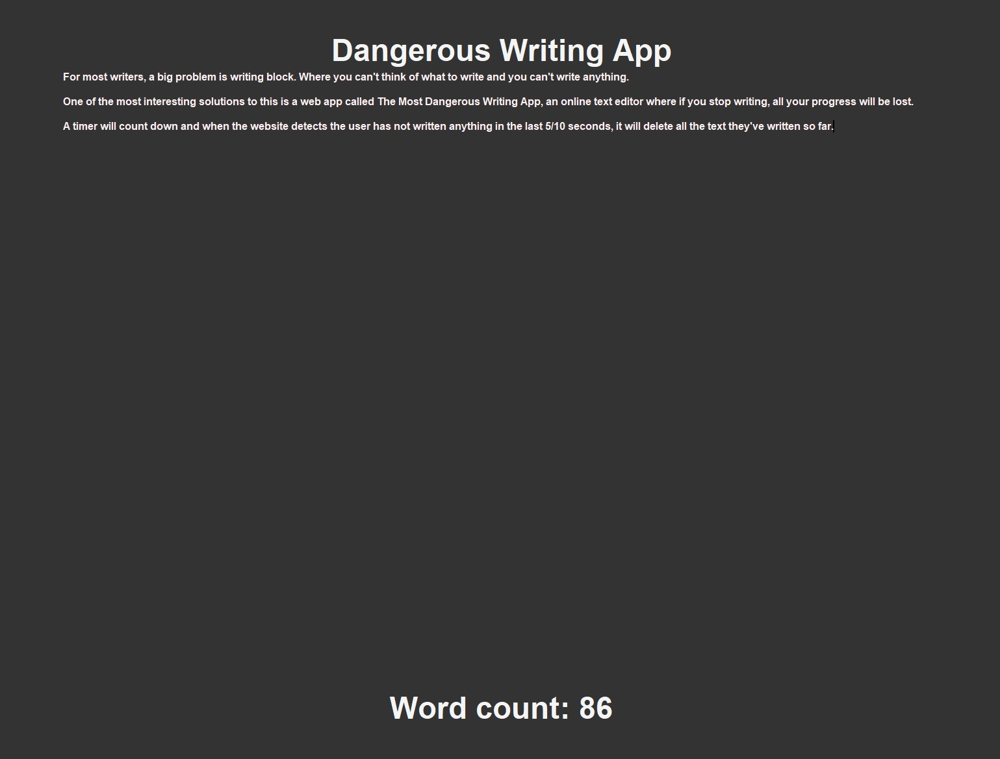

# Dangerous Text Writing App Python

For most writers, a big problem is writing block. Where you can't think of what to write and you can't write anything.

One of the most interesting solutions to this is a web app called The Most Dangerous Writing App, an online text editor where if you stop writing, all your progress will be lost.

This is a very simple python version of the application built with Tkinter.

A timer will count down and when the application detects the user has not written anything in the last 10 seconds, it will delete all the text they've written so far.

